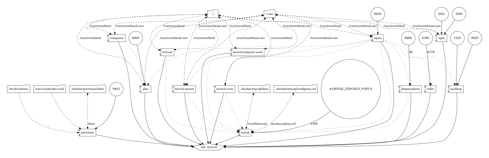

<p align="center"><a href="https://laravel.com" target="_blank"></a></p>

<p align="center">
<a href="https://github.com/laravel/framework/actions"></a>
<a href="https://packagist.org/packages/laravel/framework"></a>
<a href="https://packagist.org/packages/laravel/framework"></a>
<a href="https://packagist.org/packages/laravel/framework"></a>
</p>

Laravel Multi File Compressor
=================

<!--ts-->
* [Installation](#installation)
  * [Backend](#backend)
  * [Frontend](#frontend)
  * [Access to panel](#access-to-panel)
* [Docker](#docker)
  * [Docker-Compose](#docker-compose)
* [Portainer](#portainer)
* [Laravel](#laravel)
  * [Horizon package](#horizon-package)
  * [Configured Crontab for running Scheduled Tasks](#configured-crontab-for-running-scheduled-tasks)
* [Composer](#composer)
* [Simple QrCode](#simple-qrcode)
* [PHP](#php)
* [MySQL](#mysql)
* [PHPMyAdmin](#phpmyadmin)
* [MongoDB](#mongodb)
* [MongoClient](#mongoclient)
* [Redis](#redis)
* [Postgresql And Pg Admin Environments](#postgresql-and-pg-admin-environments)
* [Docker Compose Graph Visualization](#docker-compose-graph-visualization)
<!--te-->

Installation
============

>**NOTICE:**
>[Shecan](https://shecan.ir/) is an anti-sanction service offered by a group of researchers in Iran. It allows you to use a different DNS server and have a transparent proxy for the whitelisted domains.

Backend
-------

``` bash
# To fix errors related to the Laravel log
sudo chmod -R 0777 storage
sudo chmod -R 0777 bootstrap/cache

# build and Start Containers with Loging: 
docker-compose up  --build -d

# Just build php Dockerfile: 
docker-compose -d build

# Or Just Start the Containers: 
docker-compose up -d

docker-compose run --rm composer install

docker-compose run --rm artisan key:generate

docker-compose run --rm artisan optimize

docker-compose run --rm laravel-migrate-seed

# Install a package on laravel:
docker-compose run --rm composer require laravel/horizon
docker-compose run --rm artisan horizon:install

docker-compose run --rm npm install

docker-compose run --rm npm run dev
```

Frontend
--------

``` bash
# install dependencies
npm install

# serve with hot reload at localhost:8080
npm run dev

# build for production with minification
npm run build

# build for production and view the bundle analyzer report
npm run build --report

# run unit tests
npm run unit

# run all tests
npm test
```

Access to panel
---------------

URL: `localhost:8080/login`
| Username | User Type | Default Password |
| --- | --- | --- |
| koregeloo@gmail.com | Super Admin | password |
| koregeloo@yahoo.com | Admin | password |
| koregeloo@hotmail.com | Regular User | password |

Docker
======

Docker-Compose
-------------------------------------------

Compose is a tool for defining and running multi-container Docker applications. With Compose, you use a YAML file to configure your application’s services. Then, with a single command, you create and start all the services from your configuration.
The version: '3' refers to the Docker compose version. — [Our Docker Compose File](./docker-compose.yml)

Portainer
=========

Laravel
=========

[ENV Example File](./laravel/.env.example)

Horizon package
---------------

Configured Crontab for running Scheduled Tasks
----------------------------------------------

Composer
========

[Composer](https://getcomposer.org/doc/00-intro.md#installation-linux-unix-osx)

Simple QrCode
=============

[Simple QrCode](https://www.simplesoftware.io/#/docs/simple-qrcode)

php
===

PHP v8.2

MySQL
=====

MySQL v8

PHPMyAdmin
==========

PHPMyAdmin

MongoDB
=======

MongoDB

MongoClient
==========

MongoClient

Redis
=====

Redis v6 and v7 with configurable persistent storage

Postgresql And Pg Admin Environments
=================================

This Compose file contains the following environment variables:

* `POSTGRES_USER` the default value is **postgres**
* `POSTGRES_PASSWORD` the default value is **changeme**
* `PGADMIN_PORT` the default value is **5050**
* `PGADMIN_DEFAULT_EMAIL` the default value is **pgadmin4@pgadmin.org**
* `PGADMIN_DEFAULT_PASSWORD` the default value is **admin**

## Access to postgres

* `localhost:5432`
* **Username:** postgres (as a default)
* **Password:** changeme (as a default)

## Access to PgAdmin

* **URL:** `http://localhost:5050`
* **Username:** pgadmin4@pgadmin.org (as a default)
* **Password:** admin (as a default)

## Add a new server in PgAdmin

* **Host name/address** `postgres`
* **Port** `5432`
* **Username** as `POSTGRES_USER`, by default: `postgres`
* **Password** as `POSTGRES_PASSWORD`, by default `changeme`

## Logging

There are no easy way to configure pgadmin log verbosity and it can be overwhelming at times. It is possible to disable pgadmin logging on the container level.

Add the following to `pgadmin` service in the `docker-compose.yml`:

``` bash
logging:
  driver: "none"
```

### Docker Images

All the docker images we've used are official images pulled from the Docker Hub and then pushed into GitHub Registry.
You can remove the image base URLs (`ghcr.io/getimages/`) like the example below to use the Docker Hub images instead.

``` bash
GitHub:     ghcr.io/getimages/nginx:1.21.1-alpine
Docker Hub:                   nginx:1.21.1-alpine
```

Docker Compose Graph Visualization
==================================

This image: `docker_block_diagram.png` will generate by [GraphViz](https://github.com/pmsipilot/docker-compose-viz) in the `docker` directory.

``` bash
docker run --rm -it --name dcv -v ${PWD}:/input pmsipilot/docker-compose-viz render -m image docker-compose.yml --output-file=docker/config/docker_block_diagram.png --force
```

<p align="center">
  
</p>
